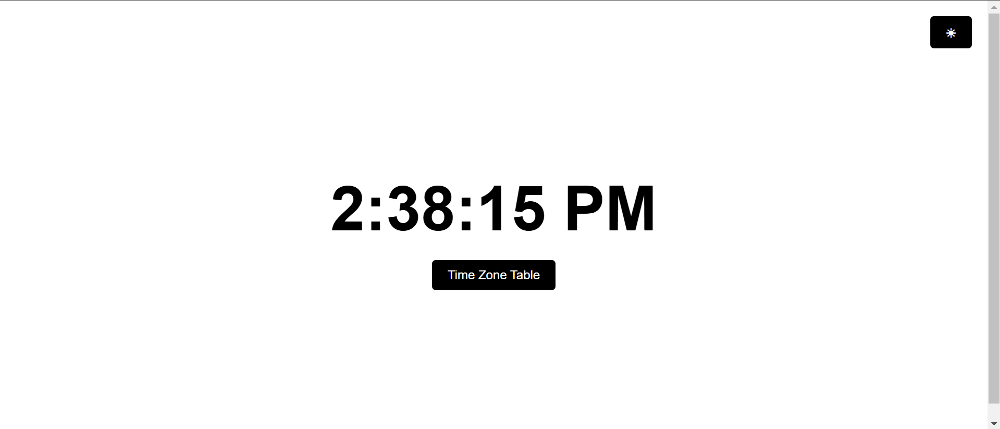
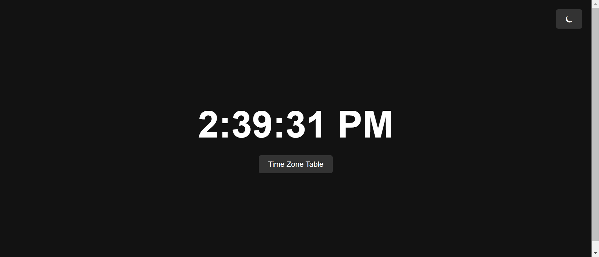
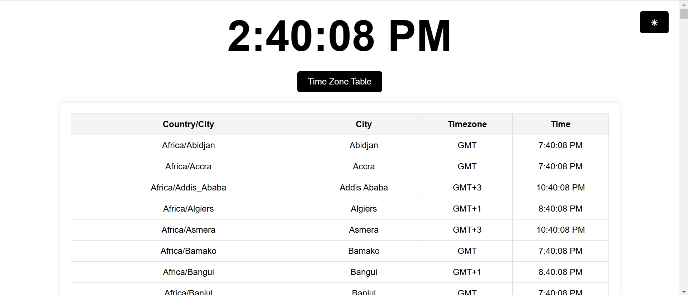

# 🌍 World Clock

A real-time world clock with a toggleable timezone table, dark mode, and responsive design, built with **HTML**, **CSS**, and **JavaScript**.




---

## Features

- **Real-Time Clock**: Displays the current local time in 12-hour format.
- **Timezone Table**: Toggle to view real-time clocks for multiple timezones worldwide.
- **Dark Mode**: Switch between light and dark themes for better readability.
- **Responsive Design**: Works seamlessly on both desktop and mobile devices.

---

## How to Use

### Live Demo
👉 [View Live Demo](https://parisa-singh.github.io/world-clock/)

### Run Locally
1. Clone the repository:
   ```bash
   git clone https://github.com/parisa-singh/world-clock.git